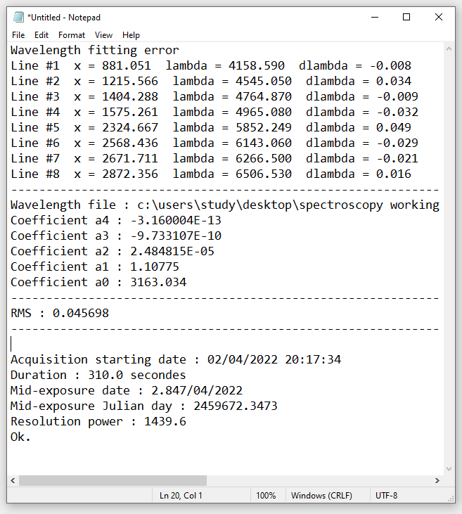

Calibration Lamps
******************

Calibration frames have long been a subject of discord within the
amateur spectroscopic community.  With the advent of CMOS cameras even
Bias and Dark calibration frames have come under scrutiny but for the 
moment we focus here on wavelength calibration and "flat" lamps.

Wavelength Calibration
The former has usually been addressed by "the dangly bulb" method
of suspending a small Ar/Ne Relco bulb, or a much larger "Filly" bulb 
over the end of the telescope object lens or aperture.  This, as we
have previously proven, has adverse affects on calibration accuracy 
and the ability to provide repeatable calibration data.

The problem arises from the movement of calibration emission lines
caused by the relative position of the bulb itself.  This is also 
described in Spectroscopy for Amateur Astronomers by Trypsteen and 
Walker (Cambridge University Press). 

Commercial spectrographs rely on the Relco bulb being placed within 
the instrument (or a closely coupled Calibration Unit).  This does 
a much better job notwithstanding the limitations of the Relco bulb
but the bulbs are generally inaccessible.

Flats
Spectroscopic "flats" have also been the source of problems.  The lack
of flux provided by Tungsten and Halogen bulbs in the blue regime
places a severe limitation on wavelength calibration and target frames 
alike resulting in low quality spectra in a region already troubled by loss
of camera sensitivity and optical component cut off.  The belief that
Flats should be generated by a black body source is outdated.

We have decided to provide a calibration unit that is housed immediately
in front of the FlexSpec fitted within its 2" nosepiece.  See The Kzin 
Ring below. This consists of a circuit board housing a pair of Relco or 
Neon Bulbs (for wavelength calibration), LED, Grains of Wheat and UV 
Boost Leds used in combination to provide a Flat source enhanced in the 
Blue and Red regimes.

Additional Red and Blue "Marker" LEDs provide a fallback method of 
providing a visual indicator for positioning the grating.

Thus, all calibration can be carried out remotely with the Kzin.

Take reference calibration images, and maintain an archive and a PDF
of graphs of results. You may note changes, and account for
variations that will occur overtime.

Kzin :index:`Kzin` ring [Niven-Ellis]_ is the name assigned to the "ring-like"
in-line passive dispersing element equally illuminated by NeAr lamps,
LEDs, and small incandescent grain-of-wheat bulbs. The ring is shaped
in a way to reside inside the 2-inch nose-piece area outside of the
main housing of Flex Spec 1 as not to take up valuable back-focus area
for popular SCTs. The permanent position of the Kzin ring means
repeatability in injecting the calibration source-light into the
spectrograph.

It has its own Arduino :index:`Kzin;Arduino`, and is controlled by a
series of software switches tied to the main functions. Each important
lamp may be set to be on for a set interval.

.. figure:: images/BlueGreenx2-1.png

   Two LEDs listed as Blue-Green.

.. figure:: images/OVLG-Comparison.png

   OVLG Leds marked as white.

.. figure:: images/WhiteFlashlight1.png

   White Flashlight.

.. figure:: images/660NK-Red.png

   660nm Red LED As 'finder' marker for grating central wavelength selection.

A wavelength calibration frame from the FlexSpec/Kzin combination and the 
RMS residual calculation from the software package ISIS (Buil) is shown below.  
It can be seen that early results show very good calibration performance 
of R = 1500+ and an RMS = 0.04.  These figures are better than similar
commercially available designs.

.. figure:: images/FS1Calibration.png

