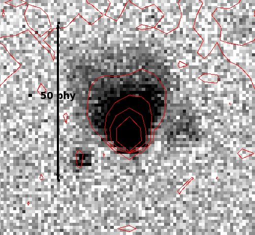

FlexSpec 1 Guiding
==================

.. _rawguide1:

.. figure:: ./images/m29_onesecodn_astrometry_net.jpeg

   Example 1-second raw guider exposure of M29, taken 2021-04-15, A. Rodda. Platesolved by nova.astrometry.net, image from ds9.

   Zoom into a guider image, showing astigmatism arising from the misalignment of the slit and guider mirror.

The :index:`FS1 guiding module` addresses matching wide field of view
surrounding the slit. This provides the opportunity to acquire the
target with an imprecise slew, plate-solve the image for precise
positioning and to increase the chances of having a brighter off-slit
star for alternative guiding. We applied the lens-makers formula to
create a compound 2-element "transfer lens" solution.  The equation

.. math::
    \frac{206264.8}{\tt{fl}\times 1000} = \frac{\tt{Magic Number}}{1 \mu{m}}

yields the ":index:`Magic Number`" in units of arc-seconds per micron for a
telescope with a focal length of :math:`{\tt{fl}}` in units of mm. This
equation allows computing/planning the :index:`slit width;matching` in terms of
arc-seconds of seeing. Matching the slit width to the OTA magnification
and seeing is critical to acquire the best signal, limit the sky
contributions and to mitigate the effects of atmospheric refraction
(see Parallactic Angle and Rotation \ref{sec:Rotator}.

In imaging, multiplying the number by the pixel size in microns,
yields the arc-seconds per pixel. Further multiplication by the size of
the chip yields the total field of view for the image. This number
should be permanently affixed to the OTA.

.. index:: 
   single: calculation;pixel size
   single: calculation;slit width

The :index:`lens makers equation`:

(DIAGRAM)

.. math::
    \frac{1}{fl} = \frac{1}{s_{1}} + \frac{1}{s_{2}} \label{E:LensMakersEquation}

is chained together for each lens in the set to match the computed
platescale on the slit to the chip size of the camera.

(EXAMPLE IMAGE).

Preliminaries
-------------

Take a small series :index:`calibration exposures`, flats, zeros and
darks for the guide camera. :index:`FS1 slit carousel` has one position
filled to serve as a general :index:`shutter` for dark exposures. 

#. Take zeros and darks, flats and make masters
#. Solve for defects: :math:`(x,y)`.
#. Slew to field
#. Take a few long exposures (10sec?) to reach mag 15
#. Correct images darks/flats/defects
#. Identify main stars and platesolve.
#. Illuminate the slit from behind.
#. Solve the slit position (:math:`y = mx+b`)

For the slit:

#. The slit has rotated.
#. Position a point-source onto the 'old' best position.
#. Science image.
#. Solve the 'Y' offset of point source.
#. Recalculate the guide :math:`(x,y)` for point source to put the dispersion axis back onto original points.

Science Camera:

#. Take zero/dark/flats
#. Determine the defect map :math:`(x,y)`.
#. Determine an optimal position :math:`(y)` for dispersion axis based on defects.
#. Record the position.

