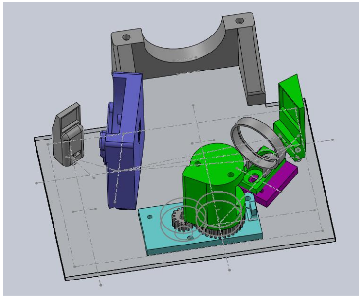

..
    extend sphinx-latexpdf docker container with the Dockerfile in the
    root of this repo
   
    apt-get update
    apt-get -y install gcc
    pip3 install numpy
    pip3 install astropy[all]
    pip3 install pandas
    pip3 install bokeh
   
    docker run -it --rm -v /home/git/external/SAS_NA1_3D_Spectrograph/docs:/docs \
                        -v /home/wayne/anaconda3/lib:/opt/lib \
                           sphinxdoc/sphinx-latexpdf /bin/bash
   
    docker run -it --rm -v /home/git/external/SAS_NA1_3D_Spectrograph/docs:/docs \
                           sphinxdoc/sphinx-latexpdf-fs1 make html
   
   
    docker run -it --rm -v /home/git/external/SAS_NA1_3D_Spectrograph/docs:/docs \
                        -v /home/wayne/anaconda3:/opt/lib \
                        -e PYTHONPATH=/home/wayne/anaconda \
                           sphinxdoc/sphinx-latexpdf make html latexpdf

    browser build/html/index.html
   
    /home/wayne/anaconda3/bin
    /home/wayne/anaconda3/condabin

INTRODUCTION
============

   CAD Layout for optical components of the FlexSpec 1.

**This project is a continuous work-in-progress. Bear with us. Better yet, collaborate with us.**

.. toctree::
   :maxdepth: 3
   :numbered:
   :caption: Contents:

   abstract
   flexspec1
   openquestions
   optics
   experiments
   overview
   physics
   mathematics
   guiding
   protocol
   controls
   communication
   serial
   software
   arduino
   cad
   electronics
   docker
   documentation
   bom
   callamps
   ovio
   outstanding
   references
   youtube
   
Indices and tables
------------------

* :ref:`genindex`
* :ref:`modindex`
* :ref:`search`

.. 

   docker run -it --rm -v /home/git/external/SAS_NA1_3D_Spectrograph/docs:/docs                         sphinxdoc/sphinx-latexpdf-fs1 make html latexpdf
