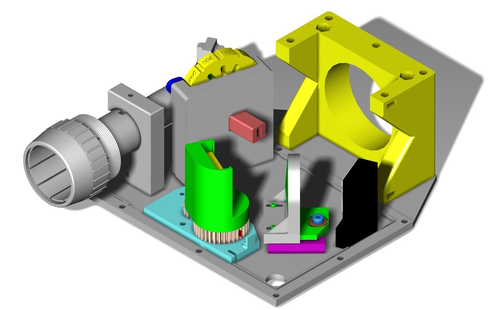

..
    extend sphinx-latexpdf docker container with the Dockerfile in the
    root of this repo
   
    apt-get update
    apt-get -y install gcc
    pip3 install numpy
    pip3 install astropy[all]
    pip3 install pandas
    pip3 install bokeh
   
    docker run -it --rm -v /home/git/external/SAS_NA1_3D_Spectrograph/docs:/docs \
                        -v /home/wayne/anaconda3/lib:/opt/lib \
                           sphinxdoc/sphinx-latexpdf /bin/bash
   
    docker run -it --rm -v /home/git/external/SAS_NA1_3D_Spectrograph/docs:/docs \
                           sphinxdoc/sphinx-latexpdf-fs1 make html
   
   
    docker run -it --rm -v /home/git/external/SAS_NA1_3D_Spectrograph/docs:/docs \
                        -v /home/wayne/anaconda3:/opt/lib \
                        -e PYTHONPATH=/home/wayne/anaconda \
                           sphinxdoc/sphinx-latexpdf make html latexpdf

    browser build/html/index.html
   
    /home/wayne/anaconda3/bin
    /home/wayne/anaconda3/condabin

INTRODUCTION
============

   CAD Layout for optical components of the FlexSpec 1.

Ramifications of 3D printing leading to FlexSpec 1 (FS1): 
Introducing the Flexible Spectrograph I
Small Telescope Spectrograph.

This is documentation, the project and our aspirations for developing
a science data quality 3D spectrograph that is 'Flexible'.

It is a continuous in progress. Bear with us. Better yet, collaborate with us.

The STL and STEP files, EDA and CAD files and the software
may be cloned from the `FlesSpec1 Github Repository <https://github.com/The-SMTSci/FlexSpec1>`_ here.

.. toctree::
   :maxdepth: 3
   :numbered:
   :caption: Contents:

   abstract
   flexspec1
   openquestions
   kzin
   ovio
   optics
   experiments
   overview
   physics
   mathematics
   guiding
   protocol
   controls
   communication
   serial
   software
   postmaster
   cad
   electronics
   arduino
   documentation
   docker
   bom
   callamps
   outstanding
   references
   youtube
   printer
   merlin
   
Indices and tables
------------------

* :ref:`genindex`
* :ref:`modindex`
* :ref:`search`

.. 
   docker run -it --rm -v /home/git/external/SAS_NA1_3D_Spectrograph/docs:/docs                         sphinxdoc/sphinx-latexpdf-fs1 make html latexpdf
