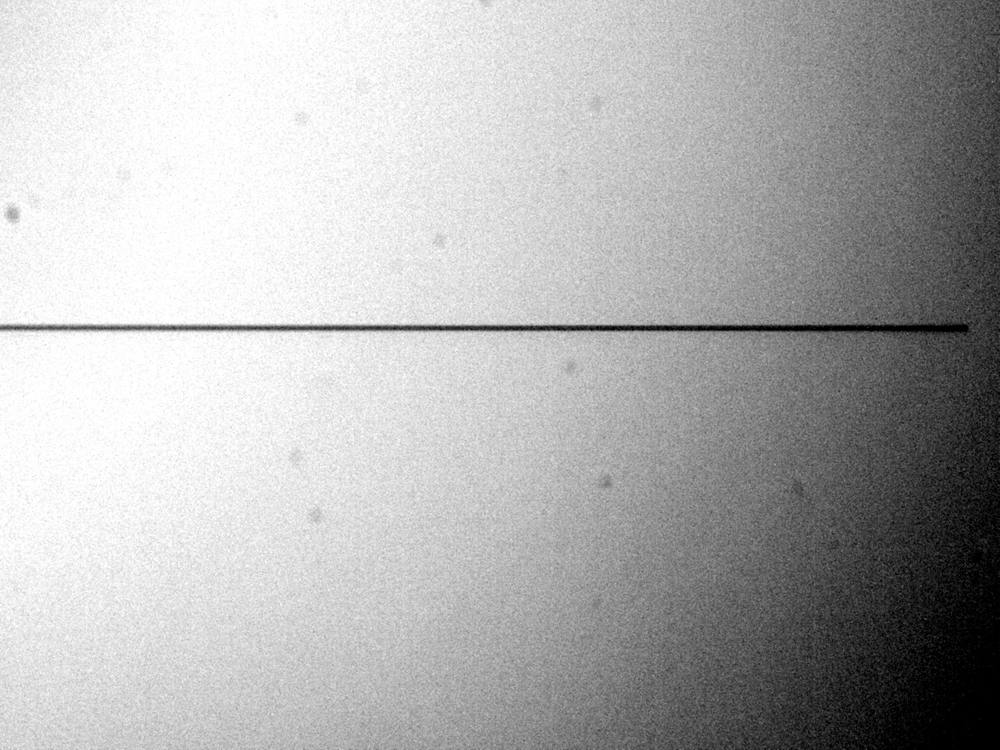
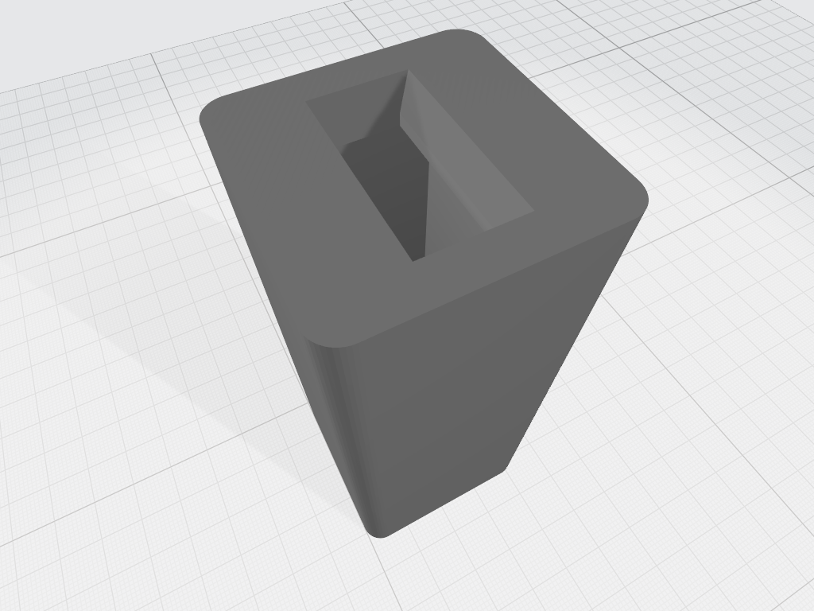

OVIO Slit
=========

The OVIO slit is a chrome-plated 1.5mm glass substrate and has 12
positions/widths:

.. list-table:: Ovio Slit
   :widths: 10 50
   :header-rows: 1

   * - Position
     - Size
   * - 1
     - 10 microns
   * - 2
     - 20 microns
   * - 3
     - 30 microns
   * - 4
     - 40 microns
   * - 5
     - 50 microns
   * - 6
     - 70 microns
   * - 7
     - 100 microns
   * - 8
     - 150 microns
   * - 9
     - 200 microns
   * - 10
     - 300 microns
   * - 11
     - 500 (Shutter)
   * - 12
     - 700 microns

The 500 micron (next to largest size) is blocked to be used as a
simple shutter to allow taking zero and dark imagess during the
daytime.

The slit disc thickness is 1.5 mm.

The slit length is 6mm which is larger than most commercial
spectrographs. Benefits are easier placement of targets in the
guide camera field of view and greater coverage of extended
objects.

We briefly investigated the idea of reversing the slit in its
holder such that the mirrored side faces the incoming beam.
We found that the guide image was noticeably improved in
briightness and that secondary images associated with bright
stars were removed. 

We did not detect any degradation in the recorded spectra,
however, we have maintained the convestion of a "reversed" OVIO
wheel for the present until we can investigate further.

The following images show a white light bench test of both
orientations.

  
.. figure:: images/GuideImageReversed.tiff

We also investigated the Fraunhofer diffraction pattern as it
emerges from the spectrograph side of the slit because theory
predicts that this will cause a degradation in overall spectra
SNR due to stray light patterns withion the spectrograph body.

INSERT IMAGE - Waynes diffraction pattern.

This is shown in the attached image which is a highly
magnified view of the slit taken from the science camera
with the grating replaced by a mirror in the zeroeth order.
 
.. figure:: ./images/FS1 FrFringe.png
 
The fringe pattern can clearly be seen. Approximately 
95% of the signal is contained within the first lobe.
Additional lobes will cause noise in the signal through
loss of collimation and focus.

We remedied this by inserting a baffle behind the OVIO
mounting such that the width of the baffle exit pupil 
removed the unwanted lobes.  This appreciably improved 
the sharpness of the spectral calibration lines.

Since this effect is clearly dependent upon wavelength
and the focal ratio of the incoming beam a compromise 
baffel exit pupil width must be allowed to accomodate
both the red and blue ends of the spectrum.

In addition, a baffle must be made for each desired 
telescope focal ratio.  The baffles are easy to modify
and fit as a 3D printed part.
 

 
The position of the baffle is shown in the following 
figure.  It can be seen as the red protrusion 
attached to the rear of the OVIO wheel mount.
 
.. figure:: ./images/FS1_Assembly_with_Baffle.png
 

A development for the FS2 will be a motorised selectable
slit wheel.

