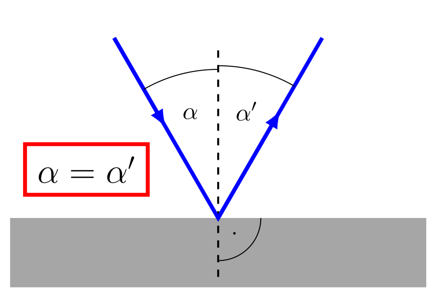
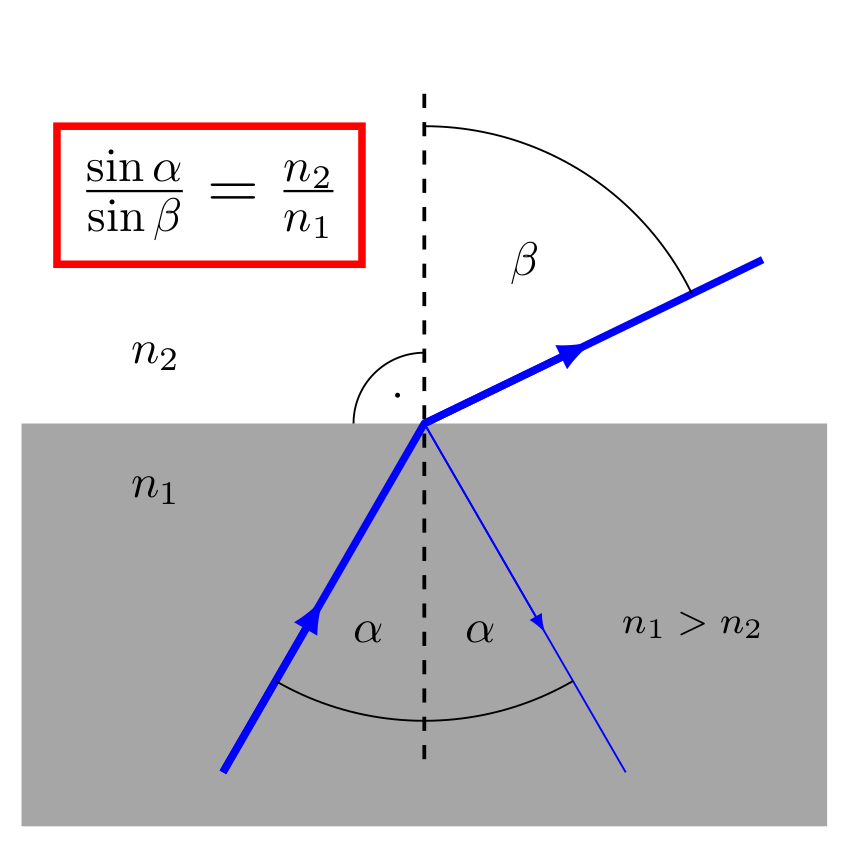
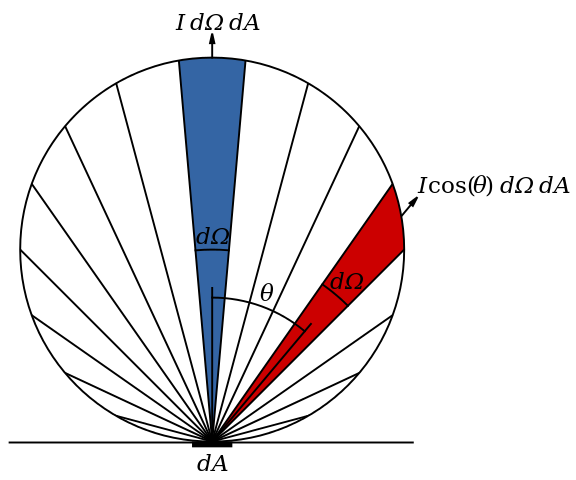

Physics
=======

This section contains the basic mathematical underpinnings used in our
analysis of the basic DIY spectroscope.

The optical :index:`sign conventions` used here follow Schroeder's (1987)
"Cartesian" approach. The plane for the optics ("lens/mirror surfaces")
are in the XY plane, the optical axis follows the Z axis.  Along the Z
axis, rays pass from the negative (lesser) to right
(greater). Reflections reverse the sign. (I.e.: photons move in the
positive direction along the Z axis.)

There are at least 6 dispersion techniques to consider:

- (1) Fresnel (nearfield),
- (1) Fraunhofer (slit) diffraction,
- (2) Reflection and transmission diffraction gratings,
- (2) Prisms and a grism (combination prism/transmission grating).

A lot of the mathematical manipulations used here are accessible via
the `Wolfram Alpha web site <https://www.wolframalpha.com>`_ , freely accessible and with paid
subscriptions.

BOTE Computation
----------------

To assist with basic design and to develop intuition, "Back of The
Envelope" :index:`BOTE` computation is in
order. Astronomers utilize the "Centimeter Gram Seconds" (CGS)
system. Here are a few guide pointers:

#. Use the same units, here centimeters;
    - :math:`5 \times 10^{-5}` cm for green light. :math:`5 \times 10^{-5}` cm for blue and :math:`6 \times 10^{-5}` cm for red. We use 300 and 600 l/mm gratings and the math cancels!
    - Translate grating :math:`l/mm to` :math:`l/cm`

#. Remember sign conventions, and get the right equation.
#. Follow the general spectrograph equation chain. Slit/grating/sensor.

Light
-----

A wavelength is a cycle, its length is a function of the energy of the
associated photon. An image has a 'wavefront' and that wavefront has a
quality, expressed in fractions of a wavelength (variation of 1/10th
of a wavelength :math:`2\times\pi/10 = 0.328` (360 degrees for a full
cycle) amounts to a shift of around 36 degrees! A lot of error. Using
a 'folding' mirror :index:`mirror;folding` adds error. This same
wavefront error seeps in with irregular coatings and lens surfaces.  It
creeps in with the parallelism agreement between the front and back of a
lens; with the co-alignment of lenses; and with the flatness of a
grating's plane.

The Behavior of Lenses
----------------------

In theory, lenses work well. In practice there is the issue of the
agreement between the curve at the front of the lens and that at the
back of the lens (a wedge or a prism-astigmatism effect). The distance
between a surface at the edge adds additional chances for
dispersion of the light as it passes through the lens. The cheaper the
lens the more likely the lens has issues.

Glass refracts, deferentially, as a function of energy (wavelength).

Lens Makers Equation
--------------------

The general form of the :index:`lens makers equation`:

.. math::
    \frac{1}{f} = (n-1) \left[ \frac{1}{R_1} - \frac{1}{R_2} + \frac{(n-1)d}{n R_1 R_2} \right]

where:

- :math:`n`  is the index of refraction,
- :math:`f`   the lens' focal lengths,
- :math:`R_1` is the **radius of curvature** of the surface towards the object,
- :math:`R_2` is the radius of curvature of the surface towards the sensor, and
- :math:`d`   is the thickness of the lens

See `Wikipedia's Lens Makers Equation <https://en.wikipedia.org/wiki/Lens#Lensmaker's_equation>`_.

Thin Lens Equation:

In practice the thin lens equation:

.. math::
   :label: thinlens

   \frac{1}{f} = \frac{1}{S_1} + \frac{1}{S_2}

Snell's Law
-----------

.. math::
    \frac{\sin\theta_2}{\sin\theta_1} =  \frac{n_1}{n_2}
     =\frac{v_2}{v_1}

.. math::\frac{n_1}{n_2}

where:

TODO: This needs to be verified the image names match the labels.

- :math:`\theta_x` are the angles involved.
- :math:`n`  is the index of refraction,
- :math:`v`  is the speed of propagation

Reflection
----------

The :index:`OVIO slit` is not an air slit. Internal reflection
tends to scramble the beam at this point.

   Total reflection (mirror).

.. figure::   ./images/xxrefractionlaw2.png
   :scale: 40%

   Reflection from a glass surface, portion of the I:subscript:`0` is lost.

.. figure::   ./images/xxrefractionlaw3.png
   :scale: 40%

   Exit angle refraction. (The other side of the slit substrate.)

   Total internal reflection.

TODO: refine this section.

The `calculator <http://hyperphysics.phy-astr.gsu.edu/hbase/phyopt/freseq.html>`_ at:

helps to calculate the pertinent values. A f/5 beam is the arctan(1/5)
= 11.30 degrees. Divided by 2 gives 5.65 degrees -- from the optical
axis to the side of the converging cone. With n\ :subscript:`1` =
1.0001 (air) and n\ :subscript:`2` = 1.53 (BK7-ish).

s-polarized:

.. math::
    R_\mathrm{s} = \left|\frac{Z_2 \cos \theta_\mathrm{i} - Z_1 \cos \theta_\mathrm{t}}{Z_2 \cos \theta_\mathrm{i} + Z_1 \cos \theta_\mathrm{t}}\right|^2

p-polarized

.. math::
    I = I_0 \frac{ 1+\cos^2 \theta }{2 R^2} \left( \frac{ 2 \pi }{ \lambda } \right)^4 \left( \frac{ n^2-1}{ n^2+2 } \right)^2 \left( \frac{d}{2} \right)^6     

TODO: https://en.wikipedia.org/wiki/Total_internal_reflection#/media/File:Total_internal_reflection_by_fluorescence.jpg

Using the `Shott Pocket Catalog <https://www.schott.com/d/advanced_optics/c36214d9-13c4-468c-bf40-8d438b89f532/1.30/schott-optical-glass-pocket-catalog-jan-2020-row.pdf>`_ 

A point source (star) receives information from the entire aperture with
a slight distortion due to its off-axis relationship. For spectroscopy,
careful centering and alignment of the 'target' position on the slit
onto a co-aligned optical axis keeps the noise symmetric. Off-axis
star means asymmetric line profiles at the sensor. Slight, but there.

In considering the `OVIO <https://en.ovio-optics.com/media/pim/assets/DocumentsPDF/std.lang.all/2-/en/Notice-Ovio-204012-EN.pdf>`_ slit with a beam consisting a pencil of rays
(bundle of rays -- each with a different approach angle to the
surface). Using the above equations it is easy to see that the f/ratio
is altered significantly as each ray enters, passes, and exits the
slit's substrate. There is a condition where internal reflection adds
an additional ray with changed geometry.  This amounts to noise in the
system. It is not a true caustic.

Grating Equation
----------------

.. math::
    :label: grating

    \frac{m\lambda}{d} = sin(\alpha) \pm sin(\beta)

where :math:`\lambda` is the wavelength, :math:`\alpha` is the angle
of incidence, :math:`\beta` is the diffracted angle (the dependent
variable of real interest). The sign :math:`\pm` is positive for
reflection gratings and negative for transmission grating. The angle
:math:`\phi = |\alpha| + |\beta|` defines the main geometry of the
system.

Spot Size and Slit Selection
----------------------------

In practice, the focal length drives the platescale eq: :eq:`pixelscale`
and aperture drives resolution :eq:`RayleighEquation`.

In general, the :index:`spot-size` is independent of the aperture, and
wholly dependent on the focal length. Since f/ratio is a derived value
-- equation eq: :eq:`pixelscale` bypasses the aperture and gives a result
as a fraction of an arcsecond per micron at the focal plane:

.. math:: \frac{206204.8}{fl\times 1000} = \frac{x^"}{1 \mu{m}}
   :label: pixelscale

This is a elementary school ratio problem: where :math:`206204.8` is
the number of arc-seconds in a radian; :math:`fl` is the focal length
in mm (traditionally stated) and multiplied by 1000 to turn into
microns; :math:`x^"` is "x" in arc-seconds; the goal of :math:`1 \mu{m}`
relates to both pixel size and slit width.

In spectroscopy, the Rayleigh equation eq: :eq:`RayleighEquation` provides
a critical estimate of the ability to separate the light from two
close objects.

.. math:: \theta = 1.22\;\frac{\lambda}{D}
   :label: RayleighEquation

where :math:`\theta` is the resolution IN RADIANS; :math:`1.22` is the
first Bessel J coefficient; :math:`\lambda` is the wavelength in units
of D; and :math:`D` is the diameter of the aperture. For
back-of-the-envelope estimates, use 5e-5 (:math:`5\times 10^{-5}`) as
the wavelength in [cm] and express D in matching units [cm].

**Observation:** The width of the slit dominates resolution within the
spectroscope. The aperture requirement stresses the need for flux over
resolution. A short focal length stresses the need for a small "spot
size", allowing a smaller slit width; in turn driving higher resolution.

The so-called 'diffraction limited' requirement of one arcsecond for
stations deep in the atmosphere only requires an aperture of around
12.58 cm (4.95 inches). This is all that is satisfy most amateur
needs under above average seeing conditions.

Sellmeier Equation
------------------

The :index:`Sellmeier Equation`, uses an empirical equation to model the
dispersion of light in medium with a given refractive index.

Values may be found at [Polyanskiy-2021]_: `Refractive Index Database <https://refractiveindex.info/>`_

.. math:: n^2(\lambda) = 1 + \sum_i \frac{B_i \lambda^2}{\lambda^2 - C_i}
   :label: sellmeier1

In practice, a small handful of empirical constants determines a
workable solution to path-times for lenses:

.. math:: \lambda = 1 + \frac{B_1 \lambda^2 }{ \lambda^2 - C_1}
      + \frac{B_2 \lambda^2 }{ \lambda^2 - C_2}
      + \frac{B_3 \lambda^2 }{ \lambda^2 - C_3}
   :label: sellmeier2

Coefficients may be had from several sources:

    +----------+---------------------------+
    |B_1       |1.03961212                 |
    +----------+---------------------------+
    |B_2       |0.231792344                |
    +----------+---------------------------+
    |B_3       |1.01046945                 |
    +----------+---------------------------+
    |C_1       |6.00069867 x 10^ 3 microns |
    +----------+---------------------------+
    |C_2       |2.00179144 x 10^-2 microns |
    +----------+---------------------------+
    |C_3       |1.03560653 x 10^ 2 microns |
    +----------+---------------------------+

Scattering
----------

In optical spectroscopy the wavelength ranges from 3300-12,000 Angstroms
or .33 to 1.2 microns. Particles or defects in the optics may be
modeled by :code:`\sigma = 2\pi\r/\lambda`. Rayleigh scattering occurs when 
:code:`\sigma << 1` and :code:`\sigma << \lambda/10`. 

..  math::
    :label: RayleighIntensity

    I &= I_0 \frac{ 1+\cos^2 \theta }{2 R^2} \left( \frac{ 2 \pi }{ \lambda } \right)^4 \left( \frac{ n^2-1}{ n^2+2 } \right)^2 \left( \frac{d}{2} \right)^6

<ref>Seinfeld, John H. and Pandis, Spyros N. (2006) ''Atmospheric Chemistry and Physics, 2nd Edition'', John Wiley and Sons, New Jersey, Chapter 15.1.1, {{ISBN|0471720186}}</ref>

..  math::
    :label: RayleighScattering

    \sigma_\text{s} &= \frac{ 2 \pi^5}{3} \frac{d^6}{\lambda^4} \left( \frac{ n^2-1}{ n^2+2 } \right)^2

``Siegel, R., Howell, J.R., (2002). [https://cds.cern.ch/record/1505325/files/9781439805336_TOC.pdf ''Thermal radiation heat transfer'']. p. 480. New York, NY: Taylor & Francis. {{ISBN|1560329688}}``

Lambertian Reflection:
----------------------

One :index:`calibration lamp` method involves flooding the guider/slit chamber with
light from an off-axis lamp. Experiments (Rodda/Yeager) showed variation
in lamp placement had a significant impact in calibration line placement
on the spectrum. Here is the simple case of light from a bulb radiating
outwards. If the lamp is replaced with a patch of the reflecting area
inside the chamber; and considering all contributions from the entire
area of the chamber -- it is easy to see where the off-axis contributions
originate.  TODO Add reference to the 'Greg's device'.

   Relationship of reflection to solid angle :math:`\Omega`. (Wikipedia)

.. math:: 
    :label: Lambert-1

    F_{tot} &= \int\limits_0^{2\pi}\;\int\limits_0^{\pi/2}\cos(\theta)I_{max}\; \sin(\theta)\;\mathbf{d}\theta\;\mathbf{d}\phi \\
    &= 2\pi\cdot I_{max}\int\limits_0^{\pi/2}\cos(\theta)\sin(\theta)\;\mathbf{d}\theta \\
    &= 2\pi\cdot I_{max}\int\limits_0^{\pi/2}\frac{\sin(2\theta)}{2}\;\mathbf{d}\theta

Using `Wolfram Alpha web site <https://www.wolframalpha.com>`_ :

.. code-block:: none

    integrate sin (2x / 2) dx from x = 0 to pi/2

.. math:: \int_0^{\pi/2} sin (2x / 2)\; \mathbf{d}x = 1

Thermal Expansion
-----------------

In general the degree of thermal expansion is :math:`\propto` inverse
of the melting point. In practice the ODE

.. math::
    :label: ThermalExpansionODE

    \alpha_{L} = \frac{1}{L}\; \frac{\mathbf{d}L}{\mathbf{d}T}

where :math:`L` is the length :math:`T` is in units of temperature.
FlexSpec 1 uses MKS, so coefficients here are in :math:`\mu{m}/m/K`.

.. csv-table:: Material Thermal Coefficients
    :header-rows: 1
    :widths: 50,15
    :align: left

    "Standard Material","Coefficient"
    "Aluminum",23.1
    "Brass",19
    "Carbon steel",10.8
    "Invar",1.2
    "Douglas-fir",3.5
    " "," "
    "3D FILAMENTS","3D FIBER COEFFICIENTS"
    "ABS",90
    "ASA",98
    "Carbon Fiber Filled",57.5
    "Flexible",157
    "HIPS",80
    "Metal Filled",33.75
    "Nylon",95
    "PETG",60
    "PLA",68
    "PVA",85
    "Polycarbonate",69
    "Polyproplyne",150
    "Wood Filled",30.5

`Simply3D Table <https://www.simplify3d.com/support/materials-guide/properties-table/>`_ has lots of properties related to 3D printer filaments.

TODO: Young's Modulus.
Same issues in every spectrograph

Things we did to minimize.

Binding within spectrograph. -> distortion.

Answer is do lots of cals.

https://www.simplify3d.com/support/materials-guide/properties-table/

..
    % (iv (setq aperturecm (* 5.5 2.54 )))    13.97
    % (iv (setq theta (/ (* 1.22 5e-5) aperturecm) ))   4.366499642090193e-06
    % (iv (setq tmp (* theta 206264.8 )))   0.9006551753758051
    % (iv (setq tmp (/ (* 1.22 5e-5) (/ 1.0 206265.8 ) 2.54)))   4.95362748031496
    % (iv (setq tmp (/ (* 1.22 5e-5) (/ 1.0 206265.8 ))))   12.582213799999998

