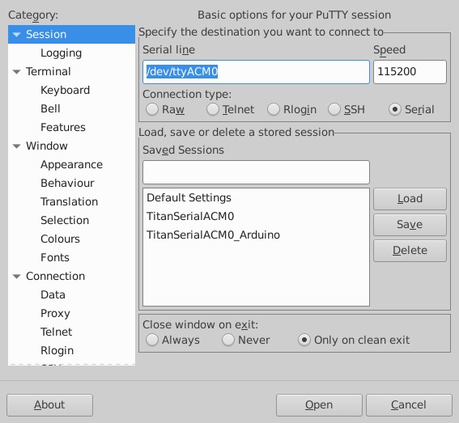
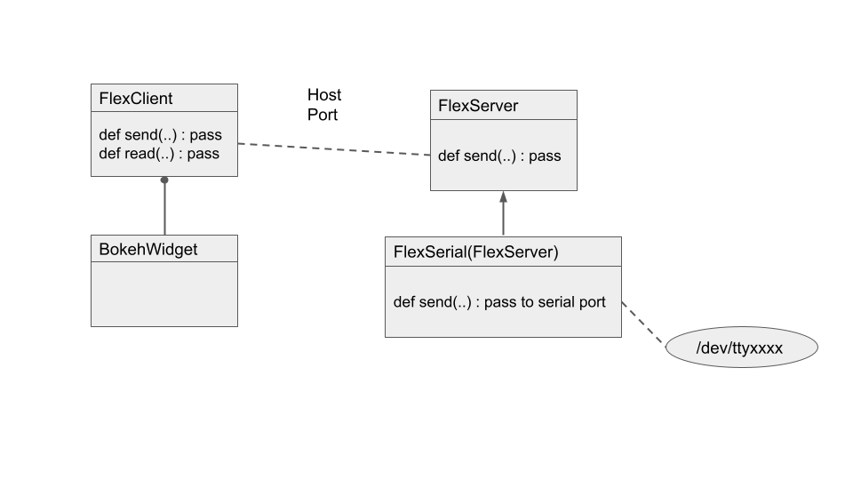

Serial Communication
====================

Raspberry Pi
------------

.. figure::   ./images/RPi-GPIO-Pinout-Diagram-2.png
   :scale: 40%

   Reference for GPIO pins. (Raspberrypi.org)

Make sure serial is enabled via the **raspi-config** file.

.. code-block:: none
   
   sudo raspi-config
   Would you like a login shell to be accessible over serial? no
   Would you like the serial port hardware to be enabled? YES
   Save and reboot.
    
.. code-block:: none
   
   minicom -b 115200 -o -D <Port_Name>

<Port_Name> is either /dev/ttyAMA0 or /dev/serial0 

Connect pin 14 and 15 (loopback) test.
minicom or similar will work.

To check what ttys are available (Astroberry example here):

.. code-block:: bash

   dmesg | grep enabled | grep -o -- "tty[0-9]\+"

Get a terminal emulator for assistance with development.

.. code-block:: bash

   sudo apt install putty

Run PuTTy, and the program starts a small GUI. In the case
of the Arduino IDE, use the Tools -> Serial -> Monitor
and, in one case, the port is "/dev/ttyACM" and the rate
is "115200".

Save the session. 

"Load" a named session. Then change the font FreeMono font-size to 14,
background (light green to sorta imply Arduino), text color to black,
cursor to black

You can change the font sizes, colors etc
via the PuTTy GUI and save with the session. Good idea to
use different color as needed.

Attach a small Arduino, running a script to print "Hello World"
every second, and you should output. This verifies a "closed
loop" solution has been achieved with PuTTy!

   Screenshot of Putty, under Ubuntu 18.04 Xfce. Note: the Category column -- where Window Color, Fonts etc may be found and changed. Note: Saved sessions offer the ability to name a session. One may achieve a pleasing appearance by selecting TitanSerialACM0_Arduino, then Load; change the options and resave.

WARNING:

COMMON VOLTAGES FOR PINS ON Small Board Computers range across
1.8, 3.3 and 5 VOLTS. MIXING SIGNALS CAN PERMANENTLY DAMAGE
HARDWARE.

FlexSpec software supports I2C and RS-232 and RS-485 as the communication
spec. I2C is a common scheme between boards located in very close
proximity. RS-485 is a differential signal scheme, range just over 1
kilometer. RS-485 wraps a 0-5V signal within a common-mode noise
voltage range of -7 to 12 V ( -7 to (0:5 +7) = 12 V). Long hauls,
multidrop capability and noise immunity are hallmarks of the RS-485
protocol.

RS232, ( Telecommunications Industry Association TIA-232-F)

* 0 (space)	Asserted	+3 to +15 V    "Computer zero"
* 1 (mark)	Passive	-15 to -3 V    "Computer one"

There is a "hysteresis" of 6V absolute (-3 to 3) between valid
signals to differentiate noise.

The maximum voltage range is from -25 to 25 volts.

The Bokeh widget uses a "has-a" relationship to one or more
PostmasterServers. The PostmasterServer may be local to same
machine or remote.  The message is passed to any subclass -- here a
FlexSerial class which owns the interface to it's local machines
serial port where Arduino/other SBMs reside.

..
    -----------------------------------------------------------------------------
    LGDehome 10PCS Max485 Chip RS-485 Module TTL to RS-485 Module for Raspberry Pi
    B08DN47BHR

    SystemBase - Made in Korea - USB to 1port RS422/RS485 Terminal
    Block(5pin TBL) Serial Converter, Cable Length 1.97ft(0.6m), Latching
    Applied USB 2.0, USB to RS422/485 Serial Converter (BASSO-1010UC)

    -----------------------------------------------------------------------------

    NOYITO TTL to RS232 Module TTL RS232 Mutual Conversion Module Serial
    Level Conversion to SP232 for MCU, ARM, FPGA, Arduino, etc. TTL Serial
    Port communicates with RS232 Level Device.

    Implements CTS and RTS. (MAX3232)
    -----------------------------------------------------------------------------

    https://opensource.com/article/20/5/tio-linux  mknod trick

